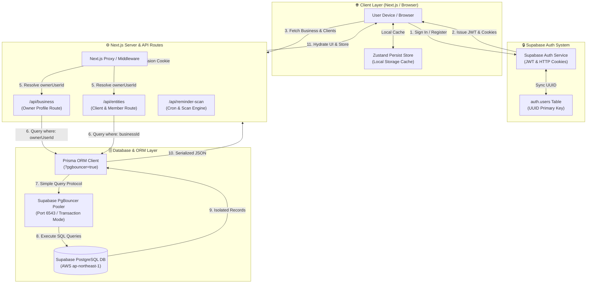
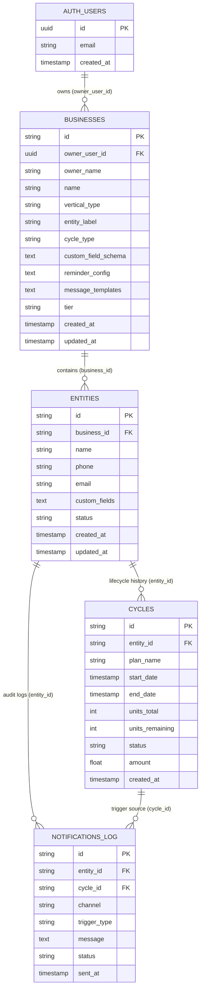
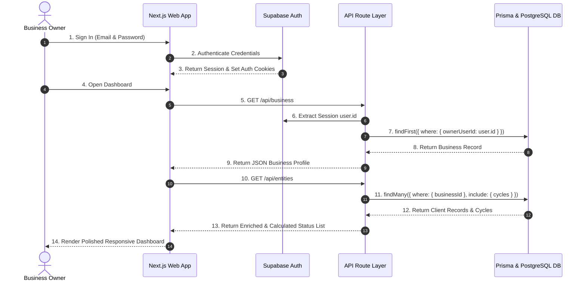

# Cycle CRM — Database Architecture & Flowchart

This document provides a comprehensive visual and structural breakdown of how the **Cycle CRM** database functions, how multi-tenant user isolation is enforced, and how data flows from user actions to Supabase PostgreSQL.

---

## 1. High-Level System Data Flowchart

The diagram below illustrates how an incoming user request traverses authentication, tenant scoping, Prisma ORM, PgBouncer connection pooling, and Cloud PostgreSQL.

---

## 2. Entity-Relationship (ER) Schema Diagram

The database uses a **single universal schema** across all business verticals (Gyms, Salons, Tuition Centers, Pet Daycares, AMC, Rentals). Verticals differ only by configuration tokens rather than table structures.

---

## 3. Step-by-Step Data Execution Lifecycle

---

## 4. Key Architectural Safeguards

### A. Multi-Tenant Data Isolation
- Every database query for businesses filters strictly by `ownerUserId: user.id`.
- Every database query for entities filters strictly by `businessId: business.id`.
- This ensures **zero cross-tenant data leaks**—different owners will never see or access each other's clients.

### B. Connection Pooling (`?pgbouncer=true`)
- Supabase Pooler operates on port `6543` in **Transaction Mode**.
- The `DATABASE_URL` is configured with `?pgbouncer=true` so Prisma uses simple query protocol and avoids prepared statement collisions (`PostgresError 42P05`).

### C. Universal Schema Design
- Custom fields per vertical (e.g., `breed` for Pets, `goal` for Gyms) are stored as structured JSON strings inside `custom_fields` and `custom_field_schema`.
- Adding new business verticals requires **zero database DDL migrations**.
