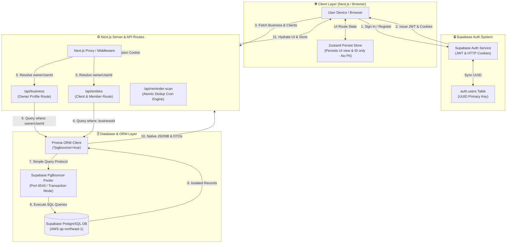
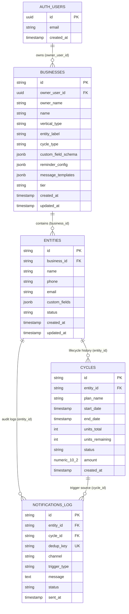
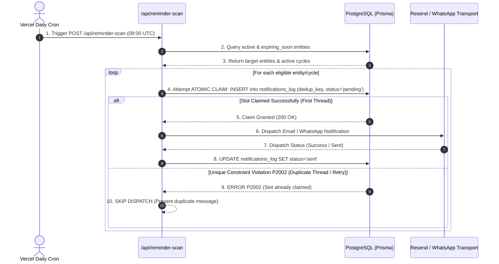

# Cycle CRM — Hardened Database Architecture & Flowchart

This document provides a comprehensive visual and structural breakdown of how the **Cycle CRM** database functions, how native PostgreSQL features (`JSONB`, `Decimal`, `dedup_key` unique constraints) enforce production reliability, and how multi-tenant isolation is guaranteed.

---

## 1. High-Level System Data Flowchart

The diagram below illustrates how an incoming user request traverses authentication, tenant scoping, Prisma ORM, PgBouncer connection pooling, and Cloud PostgreSQL.

---

## 2. Entity-Relationship (ER) Schema Diagram

The database uses a **hardened universal schema** across all business verticals (Gyms, Salons, Tuition Centers, Pet Daycares, AMC, Rentals). Verticals differ only by JSONB configuration tokens rather than table structure alterations.

---

## 3. Atomic Claim-First Reminder Engine & Execution Lifecycle

---

## 4. Key Production Architectural Hardening Features

### A. Native `JSONB` Database Types
- `custom_field_schema`, `reminder_config`, `message_templates`, and `custom_fields` are stored as native PostgreSQL `jsonb` columns.
- Prevents text stringification corruptions, enables schema indexing, and eliminates manual `JSON.parse` double-serialization.

### B. Atomic Claim-First Deduplication (`dedup_key UNIQUE`)
- `notifications_log` enforces a unique constraint on `dedup_key` (`${entityId}:${cycleId}:${triggerType}:${todayIso}`).
- The system attempts an atomic slot claim in PostgreSQL **before** triggering outbound WhatsApp or email dispatches. Concurrent cron runs or timeouts cannot cause duplicate messages.

### C. Transactional State Sync (`db.$transaction`)
- Cycle updates (renewals, decrements, lapses) and entity status calculations are executed inside atomic `db.$transaction([ ... ])` calls.
- Guarantees zero status drift between `cycles.status` and `entities.status`.

### D. Currency Precision (`numeric(10,2)`)
- Financial `amount` fields are stored using PostgreSQL `numeric(10, 2)` (Prisma `Decimal` type).
- Prevents IEEE 754 floating-point rounding errors (e.g. ₹1500.10 becoming ₹1500.099999...).

### E. Privacy & Zero Client PII Storage
- Zustand browser `localStorage` persistence stores **only** UI navigation state (`view` and `selectedEntityId`).
- Client PII (names, emails, phone numbers) is never cached in local storage, preventing stale UI states and privacy risks.
